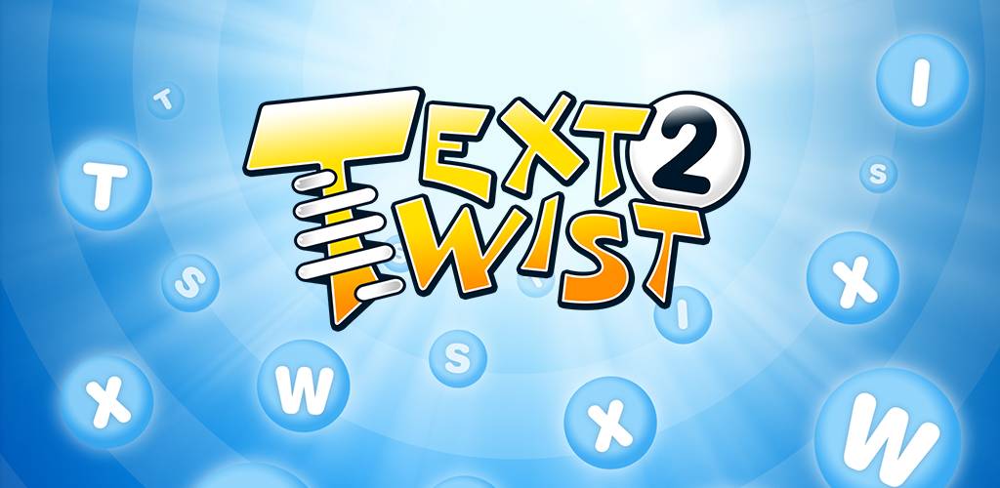

# Text-Twist 2 Robot 🤖

Repository for Text-Twist 2 Robot made by Tony Li.
If you want to use the robot for your own purposes you need only run the _Main.java_ file.
There is no need to run the robot trainer file _TextReader.java_ as I have already pre-trained
the AI to read off of _dictionary.txt_.

If you would like to increase the size of your own dictionary, you would need to
modify _TextReader.java_ to read off of a different text, then subsequently re-populate the dictionary. 

**WARNING:** after starting the program and entering the scrambled letters provided to you by
  Text-Twist 2, I have hard-coded a 5-second delay to give you enough time to
_Alt + Tab_ to the window with Text-Twist 2 playing. After this grace period the
Robot will begin entering keystrokes so please beware of this fact . . . 

Text-Twist 2 link: https://texttwist2.co/